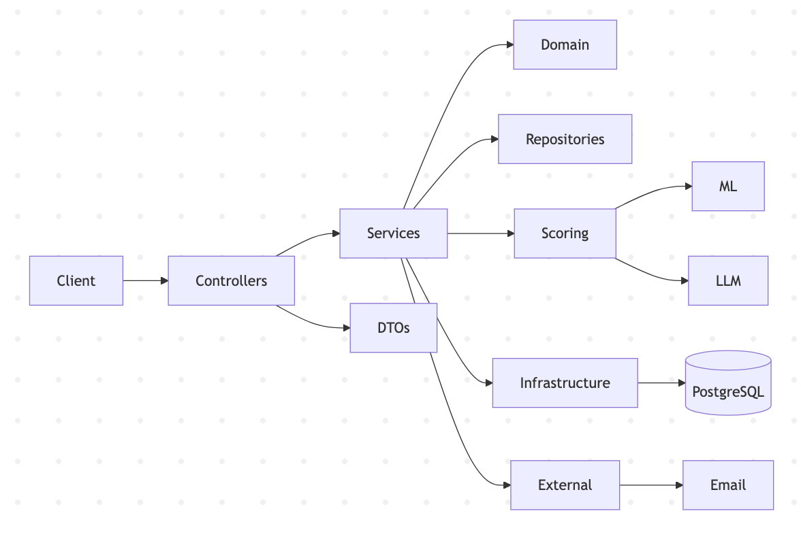

# Dependency Map

The dependency map illustrates a layered dependency structure where higher-level modules depend only on lower-level abstractions.

The API layer depends on application services and DTOs, while business logic depends on domain entities and repository interfaces.

External integrations (ML, LLM, Email) are isolated behind dedicated services and factories, preventing direct coupling between controllers and infrastructure concerns.