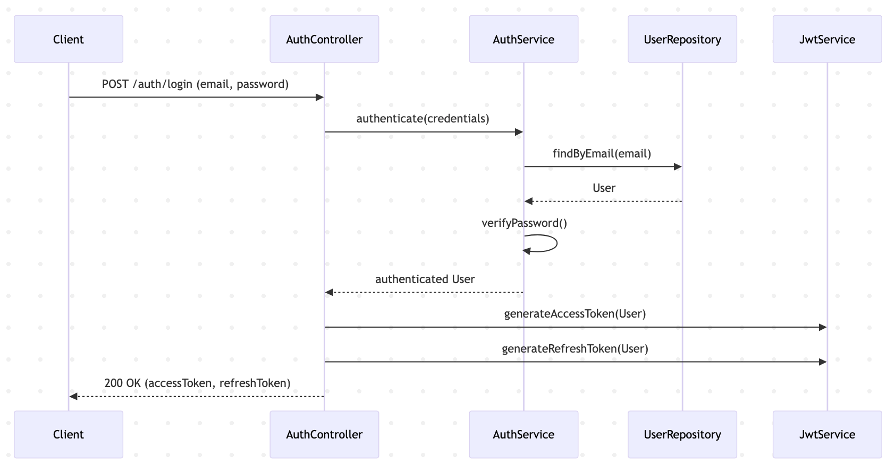
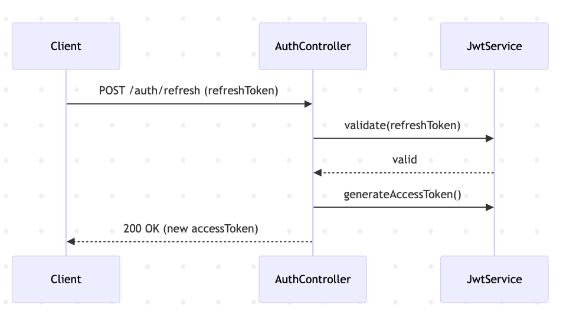

# Authentication Sequence Diagrams

This document describes authentication-related request flows, including
standard login and token refresh.

---

## User Login (Email & Password)

## Refresh Token Flow

## Failure Scenarios

- Invalid credentials → 401 Unauthorized
- Expired refresh token → 401 Unauthorized
- Missing token → 403 Forbidden