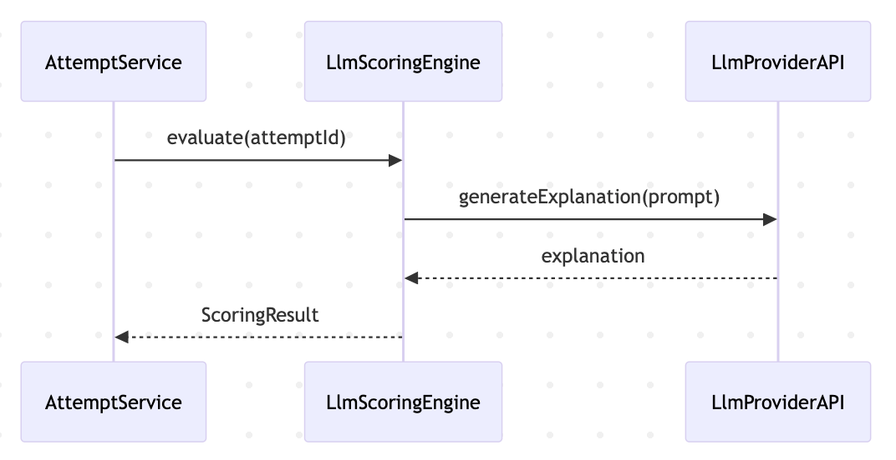

# Scoring & Recommendation Sequence

This document describes how scoring engines produce results and recommendations.

---

## ML Scoring Flow

## LLM Scoring Flow

## Design Considerations

- Scoring engines are pluggable
- External services are isolated
- Results are persisted for auditability