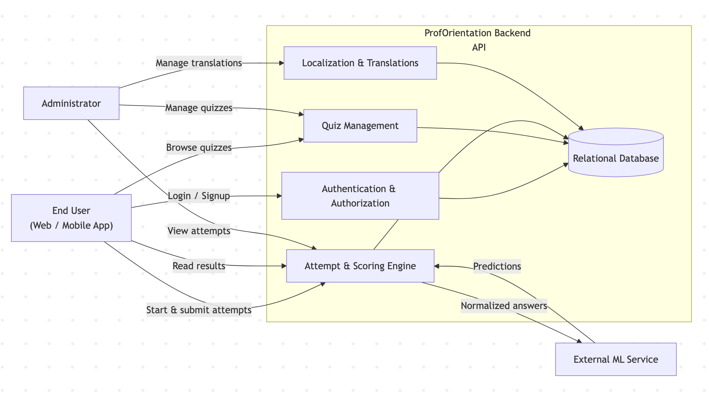

# System Context Diagram

This diagram provides a high-level overview of the **ProfOrientation platform**,
showing how external users and services interact with the system.

## Diagram Explanation
Actors

- **End User:** Interacts with quizzes, answers questions, and receives career recommendations.
- **Administrator:** Manages quizzes, questions, translations, and monitors attempts.
- **External ML Service:** Provides probabilistic career predictions based on user answers.

## System Responsibilities

| Component         | Responsibility                             |
|-------------------|--------------------------------------------|
| Authentication    | JWT-based security, role enforcement       |
| Quiz Management   | Quizzes, versions, questions, options      |
| Attempt & Scoring | Answer collection, ML & rule-based scoring |
| Localization      | Language-specific content resolution       |
| Database          | Persistent storage                         |
