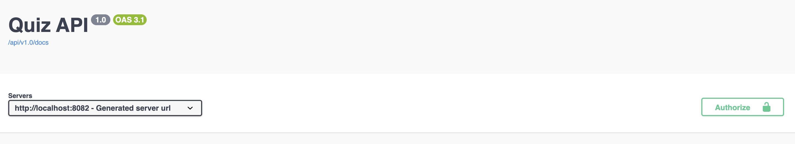
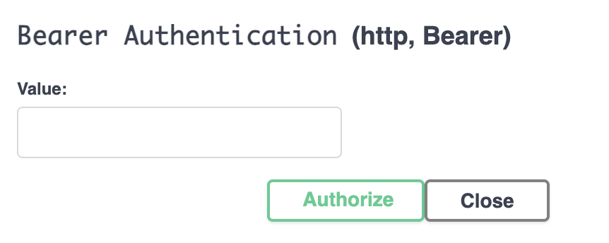

# Authentication Guide

This document explains how authentication and authorization work in the
ProfOrientation API, including token handling, security roles, and best practices
for API consumers.

---

## 1. Authentication Overview

The API uses **JWT (JSON Web Token)**–based authentication.

- Stateless authentication
- Tokens are passed via HTTP headers
- Role-based access control (RBAC)
- Refresh tokens supported

---

## 2. Authentication Flow (High-Level)

1. User registers or logs in
2. API returns:
    - Access token (JWT)
    - Refresh token
3. Client includes access token in requests
4. Token is validated on every request
5. Permissions are checked using roles

---

## 3. Register a New User

### Endpoint
POST /auth/signup

Request Body
```json
{
  "email": "user@example.com",
  "displayName": "John Doe",
  "password": "password1"
}
```

Successful Response
```json
{
  "id": 10,
  "email": "user@example.com",
  "displayName": "John Doe",
  "role": "USER"
}
```

---

## 4. Login (Email & Password)

### Endpoint
POST /auth/login

Request Body
```json
{
"email": "user@example.com",
"password": "password1",
"rememberMe": true
}
```

Successful Response
```json
{
"token": "eyJhbGciOiJIUzI1NiIsInR5cCI6IkpXVCJ9...",
"refreshToken": "eyJhbGciOiJIUzI1NiIsInR5cCI6IkpXVCJ9...",
"expiresIn": 3600000
}
```

---

## 5. Using the Access Token

All authenticated requests must include the access token.

- Save the token you received after login.
- Go to the Authorize button above.

- Enter the token and click "Authorize".


---

## 6. Refreshing Access Tokens

### Endpoint
POST /auth/refresh

Request Body
```json
{
"refreshToken": "eyJhbGciOi..."
}
```

Response
```json
{
"token": "new-access-token",
"refreshToken": "same-refresh-token",
"expiresIn": 3600000
}
```

---

## 7. Google One Tap Authentication

### Endpoint
POST /auth/google-onetap

Request Body
```json
{
"token": "<google-id-token>"
}
```
Response

Same as standard login:
```json
{
"token": "...",
"refreshToken": "...",
"expiresIn": 3600000
}
```

---

## 8. Password Reset Flow
   
### Step 1 — Request Reset Token
POST /auth/request-password-reset

```json
{
"email": "user@example.com"
}
```

### Step 2 — Reset Password
POST /auth/reset-password

```json
{
"token": "reset-token",
"newPassword": "newPassword1"
}
```

---

## 9. Roles & Authorization

The API uses role-based authorization:

| Role  | Description                                           |
|-------|-------------------------------------------------------|
| USER  | Can take quizzes, view own results                   |
| ADMIN | Can manage quizzes, questions, professions, translations |

Authorization is enforced using method-level security:
```
@PreAuthorize("hasRole('ADMIN')")
```

---

## 10. Protected Endpoints Examples
| Endpoint              | Required Role             |
|-----------------------|--------------------------|
| GET /users/me         | USER                     |
| GET /users            | ADMIN                    |
| POST /quizzes         | ADMIN                    |
| POST /attempts/start  | Authenticated or Guest   |

---

## 11. Token Expiration & Security

- Access tokens are short-lived
- Refresh tokens are long-lived
- Tokens must be stored securely
- HTTPS is required in production

---

## 12. Error Handling

Authentication-related errors follow the standard error format:

401 Unauthorized
```json
{
"code": 401,
"time": "2025-05-20T14:55:00Z",
"message": "Unauthorized"
}
```

403 Forbidden
```json
{
"code": 403,
"time": "2025-05-20T14:56:10Z",
"message": "Access denied: insufficient permissions"
}
```

---

## 13. Best Practices for Clients

- Always refresh tokens before expiration
- Do not store tokens in plain text
- Handle 401 responses gracefully
- Use role checks in UI logic
- Avoid embedding sensitive data in tokens

---

## 14. Design Rationale

JWT authentication was chosen because it is:

- Stateless
- Scalable
- Compatible with microservices
- Widely supported by tooling