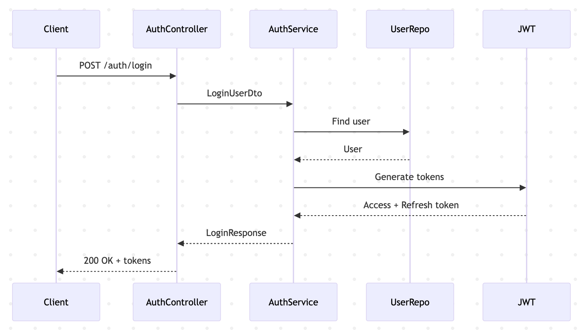

# Authentication Request-Response Lifecycle

Authentication is handled using JWT-based security:

- User submits credentials
- Credentials are validated
- JWT access and refresh tokens are generated
- Tokens are returned to the client