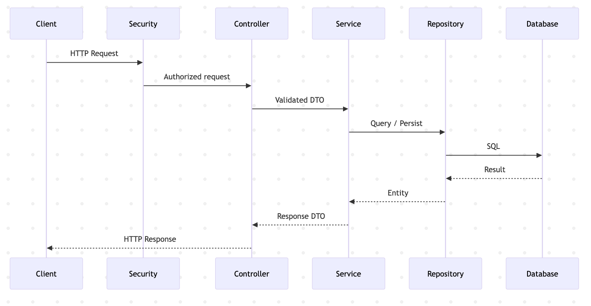

# General Request-Response Lifecycle 

Every API request follows a consistent lifecycle:

- The client sends an HTTP request to the API
- Security filters authenticate and authorize the request
- The controller validates input and delegates to a service
- The service executes business logic
- Data is fetched or stored via repositories
- A response DTO is returned to the client