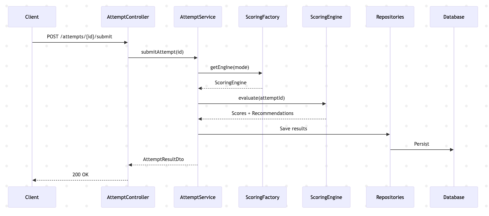

# Quiz Attempt Submission Request-Response Lifecycle

This is the most important business flow in the system.

- User submits answers
- Attempt is finalized
- Scoring engine is selected dynamically
- ML / LLM scoring is executed
- Results are persisted
- Final result is returned